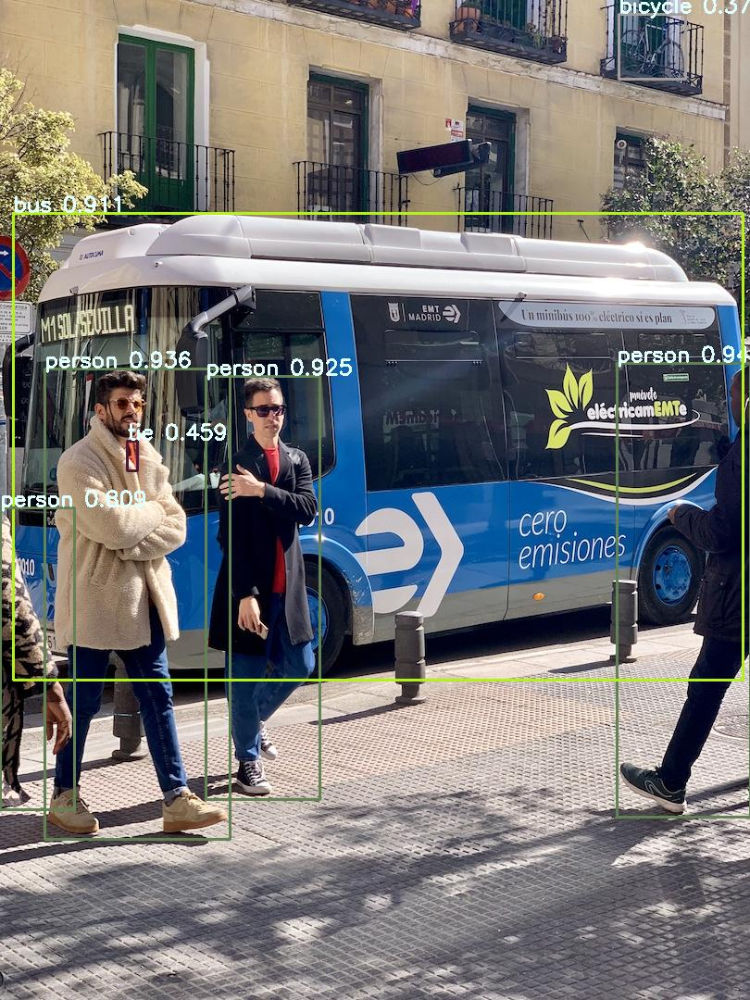

# Yolov7-openvino

## Requirements

>	python3 -m venv openvino_env

>	python -m pip install --upgrade pip
>	pip install openvino-dev[pytorch]==2022.3.0

>	pip install openvino-dev[extras]
>	pip install openvino-dev[torch]

>	pip install torch==1.13.1
>	pip install torchvision
>	pip install matplotlib
>	pip install seaborn
>	pip install onnxruntime

## Steps to Convert the model
### Convert YOLOv7 model into ONNX format using export.py script from this GitHub* repository. https://github.com/WongKinYiu/yolov7
>	wget https://github.com/WongKinYiu/yolov7/releases/download/v0.1/yolov7.pt

>	python export.py --weights yolov7.pt --grid --end2end --simplify --topk-all 100 --iou-thres 0.65 --conf-thres 0.35 --img-size 640 640 --max-wh 64

### Convert Onnx model in to IR format using model optimizer

>	mo --input_model yolov7.onnx --reverse_input_channel

## Steps to Execute the model

>	 python3 inference_yolov7.py --model yolov7/yolov7.xml --input bus.jpg --type IR

### type can be "IR" or "ONNX" to run Openvino model or to run onnx model
### By default backend is OpenVINOprovider , it can be configured CPUProvider to use with onnx runtime

## Accuarcy Measurements with openvino model
#### Pre-requisite git clone https://github.com/WongKinYiu/yolov7

>	python export.py --weights yolov7.pt --img-size 640 --batch-size 1
>	mo --input_model "{onnx_path}"  --input_shape "[1, 3, 640,640]"  --data_type FP32
>	python3 yolov7_accuracy.py -m yolov7.xml -i inference/images/horses.jpg

#####Test will run through the data base and prints the accuracy "Class,number Images, Labels,Precision,Recall,mAP@.5,mAP@.5:.95"

## Inference result with IR format

